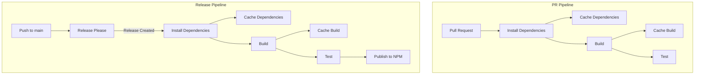

# Pipeline Restructuring Plan

## Overview

This plan outlines the improvements to our GitHub Actions workflows, splitting them into separate jobs with efficient caching strategies.

## Workflow Diagrams



## Implementation Details

### 1. PR Pipeline (.github/workflows/pr.yml)

```yaml
jobs:
  install:
    outputs:
      cache-hit: ${{ steps.cache.outputs.cache-hit }}
    steps:
      - Cache pnpm dependencies using pnpm-lock.yaml hash
      - Store ~/.pnpm-store and node_modules
      - Install only if cache miss occurs
  
  build:
    needs: install
    steps:
      - Cache build output using source files hash
      - Restore dependencies from cache
      - Build only if cache miss occurs
      
  test:
    needs: build
    steps:
      - Restore dependencies and build cache
      - Run tests using cached build artifacts
```

### 2. Release Pipeline (.github/workflows/release.yml)

```yaml
jobs:
  release-please:
    outputs:
      release_created: ${{ steps.release.outputs.release_created }}
    steps:
      - Run release-please with current configuration
  
  install:
    needs: release-please
    if: ${{ needs.release-please.outputs.release_created }}
    steps:
      - Same caching strategy as PR pipeline
  
  build:
    needs: install
    steps:
      - Same caching strategy as PR pipeline
      
  test:
    needs: build
    steps:
      - Use cached artifacts from build
  
  publish:
    needs: test
    steps:
      - Use cached artifacts for NPM publish
      - Handle NPM authentication
```

## Key Improvements

1. **Job Separation**
   - Clear separation of concerns
   - Better visibility into pipeline stages
   - Parallel execution where possible
   - Failed jobs are immediately apparent

2. **Caching Strategy**
   - Cache pnpm store and node_modules
     * Key: hash of pnpm-lock.yaml
     * Restore-keys for partial matches
   - Cache build output
     * Key: hash of source files
     * Includes dist/ and other build artifacts
   - Efficient cache restoration between jobs
   - Proper cache invalidation on dependency/source changes

3. **Conditional Execution**
   - Release pipeline jobs only run on actual releases
   - PR pipeline runs on all PRs to main
   - Skip unnecessary work based on cache hits

4. **Performance Optimizations**
   - Parallel job execution where possible
   - Minimize redundant work through caching
   - Efficient artifact passing between jobs
   - Smart cache key generation

## Next Steps

1. Implement PR pipeline changes
2. Test caching behavior
3. Implement release pipeline changes
4. Validate release-please integration
5. Document cache management strategy