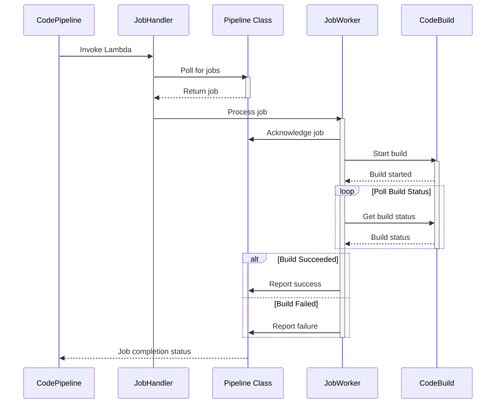
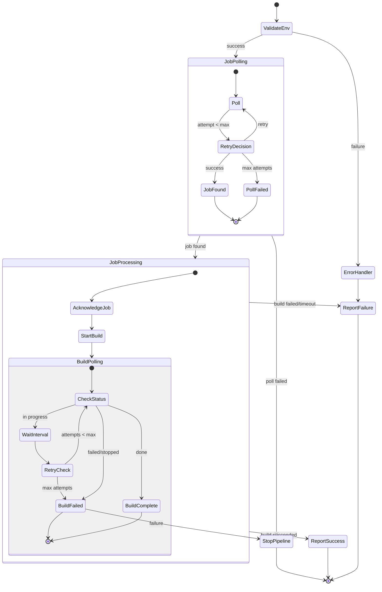
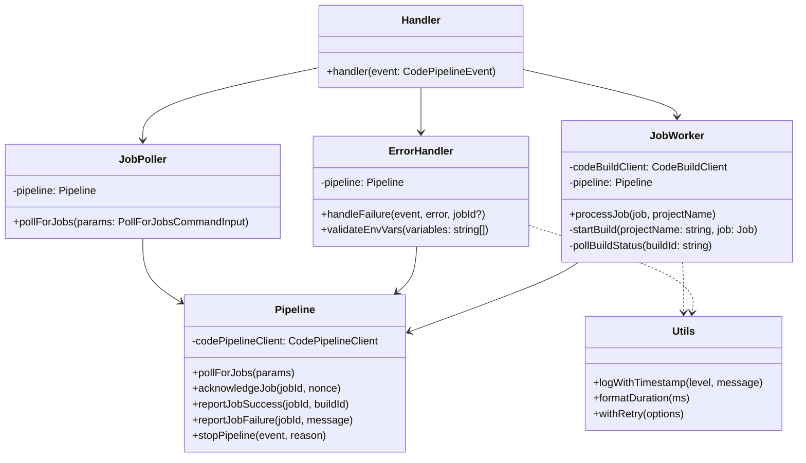

# Job Handler Lambda

This Lambda function handles AWS CodePipeline job processing for GitLab source actions.

## Sequence Diagram



## Activity Diagram



## Component Structure



## Function Flow

1. **Lambda Handler** (`index.ts`):

    - Validates environment variables
    - Sets up job polling parameters
    - Orchestrates component interactions
    - Handles error reporting and pipeline control

2. **Job Polling** (`poller.ts`):

    - Retries up to 3 times with exponential backoff
    - Handles job polling errors
    - Uses Pipeline class for AWS API calls

3. **Job Processing** (`job.ts`):
    ```
    processJob
    ├── acknowledgeJob (Pipeline)
    ├── startBuild
    │   ├── Validate output artifacts
    │   ├── Configure build params
    │   └── Start CodeBuild project
    │
    │   └── splitObjectKey
    ├── pollBuildStatus (with retry)
    │   └── getBuildStatus
    └── reportJobStatus (Pipeline)
        ├── reportJobSuccess
        └── reportJobFailure
    ```
4. **Error Handling** (`error.ts`):

    ```
    handleFailure
    ├── Log error details
    ├── Stop pipeline
    ├── Report job failure (if job ID exists)
    └── Throw wrapped error
    ```

5. **Pipeline Operations** (`pipeline.ts`):
    - Handles all CodePipeline API interactions
    - Manages job lifecycle (ack, success, failure)
    - Encapsulates pipeline-specific error handling

## Error Handling

The job handler implements multiple layers of error handling:

1. **Top Level**:

    - Environment validation errors
    - Unexpected runtime errors
    - Job polling failures

2. **Job Processing**:

    - Build startup failures
    - Build execution failures
    - Output artifact validation

3. **Build Polling**:

    - Retries with exponential backoff
    - Handles transient AWS API errors
    - Tracks build phase transitions

4. **Pipeline Operations**:
    - Job acknowledgment failures
    - Status reporting failures
    - Pipeline stopping failures

All errors result in:

1. Pipeline stopping
2. Job failure reporting (if job exists)
3. Detailed error logging
4. Clean lambda exit

## Retry Configuration

Build Polling Configuration:

- Interval: 4 seconds
- Max Attempts: 10
- Total Maximum Time: 40 seconds

## Logging

The job handler provides detailed logging with timestamps:

- Job status transitions
- Build status updates
- Error details
- Operation durations

Example log:

```
[2025-03-04T12:51:32.090Z] Processing job with ID: 7fdcfa94-43fb-4a8a
[2025-03-04T12:51:32.178Z] Build started with ID: 123456
[2025-03-04T12:51:36.178Z] Build status: IN_PROGRESS (DOWNLOAD_SOURCE)
[2025-03-04T12:51:40.178Z] Build status: SUCCEEDED
[2025-03-04T12:51:40.280Z] Successfully processed job (duration: 8.19s)
```
